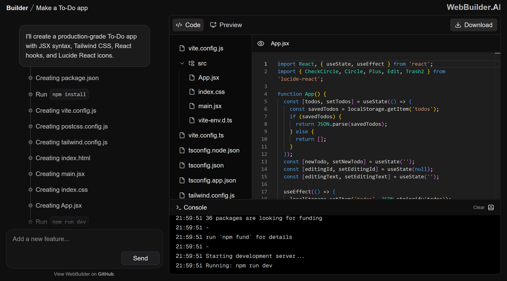
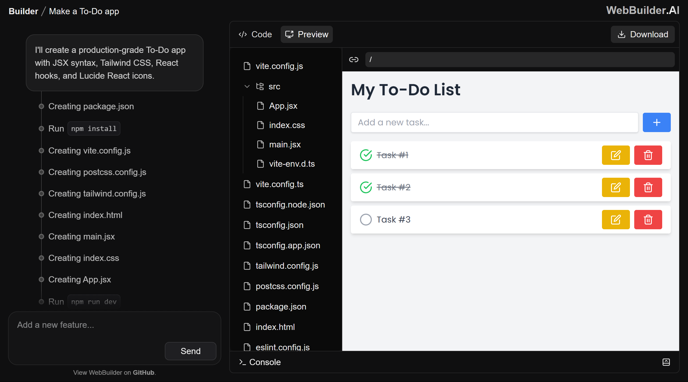

> [!NOTE]  
> This project is an attempt to recreate the software architecture of other AI web builders like [V0.dev](https://v0.dev/) and [Bolt.new](https://bolt.new/)

<table align="center" style="margin: auto; text-align: center;">
  <tbody>
    <tr>
      <td>
        
      </td>
      <td>
        
      </td>
    </tr>
    <tr>
      <td><b>Code Interface</b></td>
      <td><b>Live Preview</b></td>
    </tr>
  </tbody>
</table>

**WebBuilder.AI** is an AI-powered web application builder that allows users to create full-stack web applications using natural language prompts. Code is generated on the backend server and executed in-browser using [WebContainer](https://webcontainers.io/).

## Software Architecture

### Backend (Node.js + Express)

#### Core Modules

- **Template Engine**: Processes and returns boilerplate templates from `/template`
- **AI Generator**: Handles prompt analysis and code generation through Gemini AI from `/chat`

#### API Endpoints

   - `POST /template`
      - Input: User prompt
      - Output: Template files

   - `POST /chat`
      - Input: User prompt + Template files
      - Output: Generated code (step-based structure)

### Frontend (Next.js)

#### Core Components

- **FileExplorer**: Renders a tree-view of the project directory.
- **CodeEditor**: Monaco-based file editor for editing project files.
- **Terminal**: Displays logs and executed shell commands.
- **PreviewFrame**: Embeds the live app using WebContainer’s server.

#### State Management

- React hooks for component state
- Context API for global terminal and container state
- WebContainer API for file system operations, runtime execution, and dependency installation

## Tech Stack

<table style="width: 100%; border-collapse: collapse;">
  <thead>
    <tr>
      <th style="text-align: left; padding: 8px; border-bottom: 1px solid #ccc;">Category</th>
      <th style="text-align: left; padding: 8px; border-bottom: 1px solid #ccc;">Technologies</th>
    </tr>
  </thead>
  <tbody>
    <tr>
      <td style="padding: 8px; vertical-align: top; border-bottom: 1px solid #eee;">Frontend</td>
      <td style="padding: 8px; border-bottom: 1px solid #eee;">
        WebContainer API 1.6.1 
        Next.js 15.3.2 
        React 19 
        TailwindCSS v4 
        TypeScript
      </td>
    </tr>
    <tr>
      <td style="padding: 8px; vertical-align: top; border-bottom: 1px solid #eee;">Backend</td>
      <td style="padding: 8px; border-bottom: 1px solid #eee;">
        Node.js 
        Express 
        Google Gemini AI 
        TypeScript
      </td>
    </tr>
  </tbody>
</table>

## Workflow

1. User enters a prompt describing the desired application.
2. The prompt is sent to the backend via the `/template` endpoint.
3. The backend determines the type of application (For now, only React and Node) and returns relevant template files.
4. The frontend:
   - Receives the templates
   - Initializes the WebContainer
   - Installs dependencies
   - Sends a request to the `/chat` endpoint with the prompt and templates
5. The backend processes the prompt and template with Gemini AI and returns generated code.
6. The frontend:
   - Parses the response
   - Splits it into steps
   - Updates the project file system
   - Executes corresponding shell commands in the terminal
7. The result is displayed in the live preview section.

## Features added till now

- Natural language-based web app generation
- WebContainer based in-browser runtime
- Editable file system with real-time updates
- Live application preview
- Live terminal logs from the WebContainer

